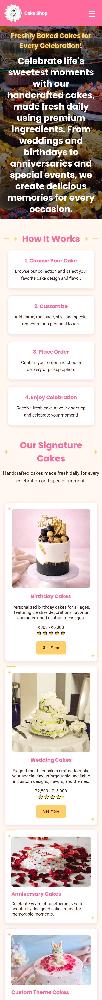
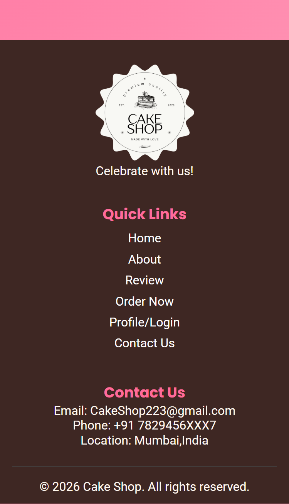

# Cake Shop Website - Project 2

## Overview

This project was developed as part of the DecodeLabs Frontend Development Internship.

The objective of Project 2 was to create a responsive web layout that adapts seamlessly across desktop, tablet, and mobile devices using CSS media queries and responsive design techniques.

---

## Project Preview

### Desktop View

### Tablet View

### Mobile View

### Responsive Navigation

### Footer Section

---

## Features

- Responsive Navigation Bar
- Mobile-Friendly Layout
- Hamburger Menu for Small Screens
- Flexible Grid Layouts
- Responsive Images
- Optimized Spacing and Alignment
- Hero Section
- Product Showcase
- Customer Reviews Section
- Celebration Extras Section
- Footer with Contact Information

---

## Technologies Used

- HTML5
- CSS3
- Flexbox
- CSS Grid
- CSS Media Queries
- Responsive Web Design

---

## Learning Outcomes

- Responsive Design Principles
- Mobile-First Development
- CSS Flexbox
- CSS Grid
- Media Queries
- Cross-Device Compatibility
- Navigation Design

---

## Status

✅ Completed

---

## Author

**Sanskruti Shelar**   
Frontend Development Intern 
DecodeLabs
